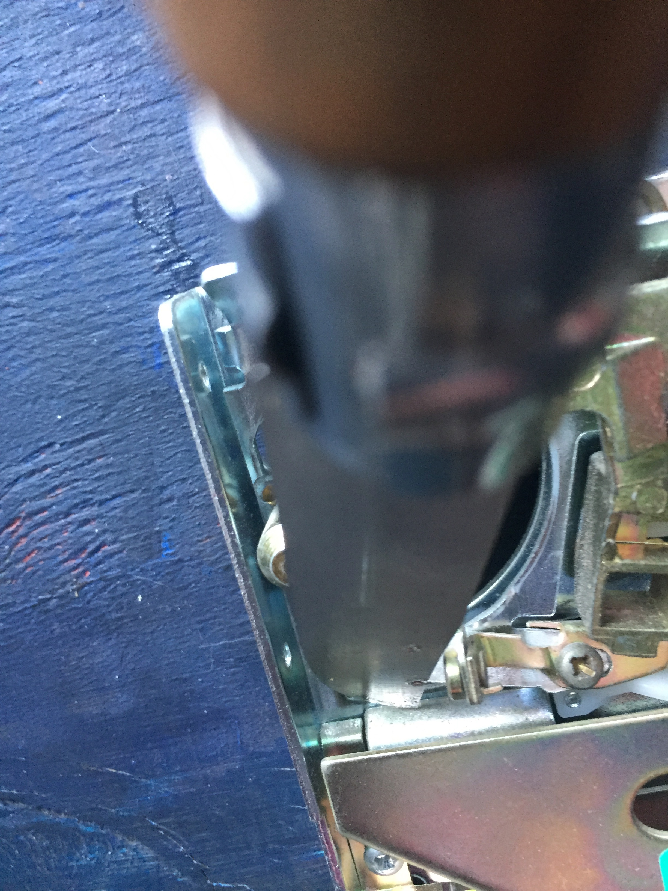

## What is donation op..
Converting the mechanism inside the coin acceptors to accept any coin.

It involves bending one piece in this particular mechanism, and 3d-printing a small part to divert another part of the mechanism the coin might possibly go to.

Mechanism:

Part to bend:

Where to place the 3d printed part:

## Trivia
The small stub on the bottom right is actually a magnet, which is supposed to divert the nickel-containing (and thus magnetizable) guilder/gulden/florijn to the left "accept" slot.